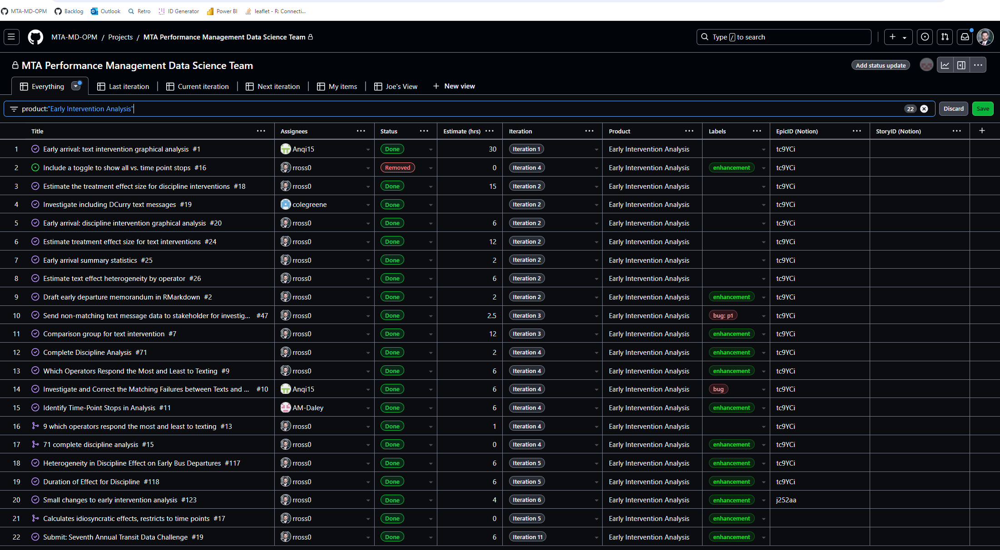

```{r setup, include=FALSE}
knitr::opts_chunk$set(echo = F)
```

Hello Transit Research Board,

I am happy to submit the GitHub repository [MTA-MD-OPM/mta_trb_data_challenge_2025_submission](https://github.com/MTA-MD-OPM/mta_trb_data_challenge_2025_submission) on behalf of the Maryland Transit Administration's Office of Performance Management. This repository contains an analysis of two different MTA policies designed to increase on-time bus operations. In addition, this repository contains all of the programming code, and most of the data required to produce these analyses (including the code that generated this word document). 

### Context 

The MTA is working hard to improve on-time departure rates for bus service. Busses may leave a stop late for many reasons, but early departures are mostly at the discretion of the bus operator. Early departures are undesirable; busses that depart early may leave before boarding passengers who time their arrival based on published schedules. This may lead to frustration on the part of these passengers, and passengers may arrive at their destination late because the next scheduled bus is several minutes later than the bus they intended to take. 

In order to prevent early departures, the MTA enacted two policies. The first policy is an intervention in real-time; Operators receive a text message on their on-board Mobile Data Terminal when their bus is ahead of schedule. The hypothesis is that bus drivers who receive this text will be reminded to delay their bus and re-align with their scheduled route, while drivers who do not receive the text will run increasingly ahead of schedule. The null is that texting has no impact on drivers' schedule adherence, either because drivers do not respond to the text message and continue to run early, or because all drivers naturally adjust their schedule adherence during their work pieces. Both hypotheses have supporting anecdotal evidence.

The second policy is retroactive; MTA pursues employment actions against bus operators who consistently depart stops early. These actions typically consist of written reprimands, but may be escalated to termination on a case-by-case basis.

I was the primary developer on this project, writing nearly all of the code and analysis, and I presented these results to the CEO of the MTA, and many other members in leadership. 

### Methodology

The methodology of each analysis is documented in the code and the [final report](https://github.com/MTA-MD-OPM/mta_trb_data_challenge_2025_submission/blob/main/Effect-of-Live-Texts-on-Bus-Operator-Early-Departures.html). To read this report, click the download button on the top right of the code file, and open the downloaded .html file in any web browser.

I want to highlight the elements of this analysis that are innovative in the transit data space. This analysis was produced using git version control, which allows a higher degree of transparency into the data and process used to build these analyses. Any data scientist at the MTA with access to our databases can reproduce the results in this analysis. Data scientists outside the MTA can read my source code to understand how I conducted the analysis. Leveraging git allows data teams to coordinate their efforts asynchronously and remotely, producing better insights faster.

Second, the analysis was built in iterations (a core MTA value) by a team of data scientists working in a scrum framework. Below you can see a screenshot of the individual work items tracked over five iterations which ultimately produced this analysis. Working in small increments helps teams answer stakeholders' most important questions early while gathering regular feedback on progress. 

```{r, out.width='100%', fig.pos='center', fig.cap='Kanban Board', fig.title ='An Alt text'}    
 


```

Finally, all work is done in R, a free, open-source programming language accessible to all transit agencies. This repository is covered by a GNU GENERAL PUBLIC LICENSE, and data scientists at other agencies are encouraged to use any elements they find useful.

### Outcomes

This repository represents the first data science product produced at the MTA by and MTA employee using modern data science tools and practices, including git, R, and scrum. Modern data science practices allow every organisation, including all transit agencies, to produce better insights, faster, in a reproducible and scaleable manner. These practices allow teams of data scientists to work together on large-scale projects without coordination problems. 

My analysis clearly and convincingly answered a pressing operational question, allowing leadership to make informed policy decisions. 

Any agency that already has some digital data management system (SQL server, excel files, Access database, etc.) can replicate this methodology. R and RStudio are free data science tools, and GitHub allows users to create organisations and repositories for free. 

### Visuals 

Visuals can be found in the [final report](https://github.com/MTA-MD-OPM/mta_trb_data_challenge_2025_submission/blob/main/Effect-of-Live-Texts-on-Bus-Operator-Early-Departures.html). To read this report, click the download button on the top right of the code file, and open the downloaded .html file in any web browser.
